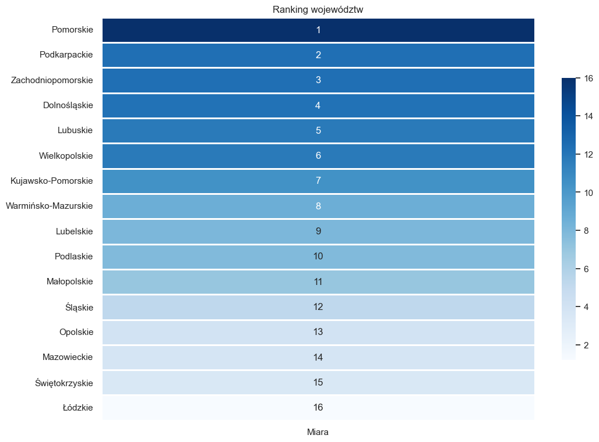

### Cel projektu
Głównym celem pracy jest zidentyfikowanie cech wpływających na warunki życia mieszkańców województw, oraz ostatecznie wskazanie tych, w których jakość życia jest najwyższa i najniższa. Analiza została przeprowadzona z wykorzystaniem metod analizy wielowymiarowej. Pozwoliło to zrozumieć specyfiki i różnice między poszczególnymi województwami.
### Cechy
Praca skupia się na szerokiej gamie cech, które odzwierciedlają różnorodne aspekty życia społeczno-ekonomicznego. Pozyskano je z [Banku Danych Lokalnych GUS](https://bdl.stat.gov.pl), a następnie przeskalowano w celu uzyskania jednolitej skali przed analizą.

1. Liczba bezrobotnych na 100 ludności
2. Liczba przychodni na 10 tys. ludności
3. Liczba lekarzy przypadająca na 1 osobę w tysiącach
4. Liczba przestępstw w ludności (w setkach)
5. Liczba wypadków na 10 tys. ludności
6. Mieszkania oddane do użytkowania na 1 tys. ludności
7. Mediana cen mieszkań w tysiącach
8. Liczba imprez przypadających na 10 tys. mieszkańców
9. Liczba muzeów przypadająca na 100 tys. mieszkańców
10. Liczba obiektów sportowych na 10 tys. mieszkańców
11. Liczba miejsc na widowni w kinach przypadająca na 100 mieszkańców
12. Powierzchnia lasów przypadająca na 10 km² powierzchni
13. Emisja zanieczyszczeń gazowych na 1 tys. km² (w tysiącach)
14. Długość linii komunikacji miejskiej na 10 tys. mieszkańców
15. Osoby bezdomne w noclegowiskach na 1 tys. ludności
16. Rodziny, którym przyznano świadczenia z powodu ubóstwa na 100 ludności

### Wyniki

### Źródła
* Balicki A., *Statystyczna analiza wielowymiarowa i jej zastosowania społeczno-ekonomiczne*, Wydawnictwo Uniwersytetu Gdańskiego, Gdańsk 2013.
* [Bank Danych Lokalnych GUS](https://bdl.stat.gov.pl)